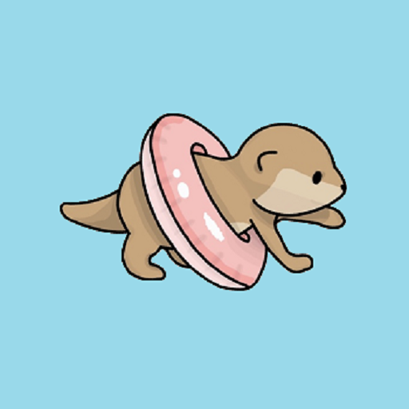
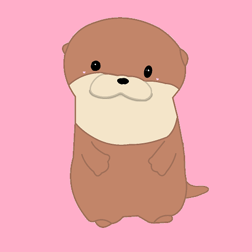
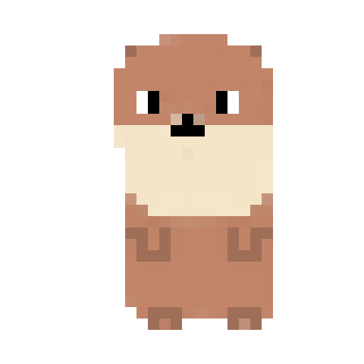
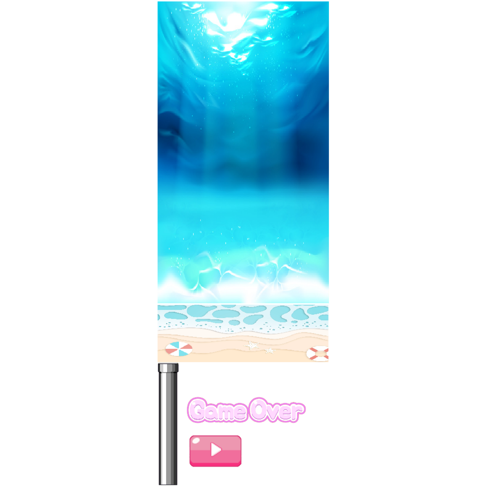
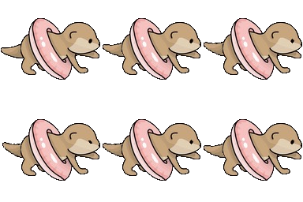

# 🦦 Otter's Journey  
> 수달의 모험 (Flappy Bird Clone)  
> 개발일자: 2022.08.21  
> [시연 영상 보기 ▶️](https://www.youtube.com/watch?v=0zgFyqS_gm0)

---

## 🎮 소개

**Otter's Journey**는 플래피버드를 모티브로 제작한 2D 횡스크롤 게임으로, 귀여운 수달이 튜브를 타고 장애물을 통과해나가는 게임입니다.  
처음으로 유니티를 활용해 완성한 게임 프로젝트로, **게임 아트(수달, 아이콘, 애니메이션)**까지 직접 제작하여 삽입했습니다.

- 🎯 Unity 기반 FlappyBird 게임 구현
- ✏️ 수달 캐릭터 및 게임 에셋 직접 제작
- 🎨 Pixel Studio, Photoshop 일부 활용
- 📱 Google Ads 연동 (배너 광고 시도)

---

## 🧸 게임 캐릭터 & 로고

| Main Character (수달) | Game Icon | Pixel Style |
|------------------------|-----------|--------------|
|  |  |  |

---

## 🧱 게임 구성 요소

| 배경 (무료 에셋) | 수달 애니메이션 스프라이트 |
|------------------|-----------------------------|
|  |  |

---

## 🎥 게임 플레이 장면

| 장애물 통과 시 | 장애물 없는 플레인 모드 |
|----------------|---------------------------|
|  |  |

---

## 🛠 기술 스택

| 도구/언어 | 설명 |
|-----------|------|
| **Unity** | 전체 게임 구현, 충돌 판정, 물리 처리 등 |
| **C#** | 캐릭터 이동, 장애물 생성, 점수 및 게임 상태 제어 등 |
| **Pixel Studio** | 도트 기반 캐릭터 및 애니메이션 제작 |
| **Google Ads** | Unity Ads SDK로 배너 광고 삽입 시도 |
| Photoshop | 일부 에셋 편집 및 리사이징 |

---

## 🔗 외부 참고 링크

- [🎬 제작 참고 영상 (Flappy Bird Clone)](https://www.youtube.com/watch?v=EqoU1PodQQ4)
- [📺 시연 영상 보기](https://www.youtube.com/watch?v=0zgFyqS_gm0)

---

> 귀여운 수달과 함께 떠나는 바닷속 모험!  
> Unity와 C#을 통해 게임 개발을 처음 시작하는 분들에게 적합한 입문형 프로젝트입니다.
